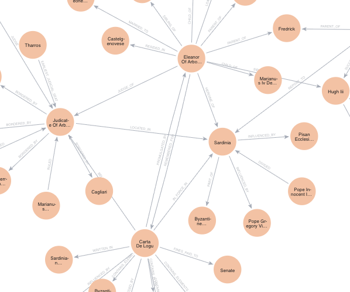

# Graph RAG with Neo4j - Eleanor of Arborea Knowledge Graph

A Retrieval-Augmented Generation (RAG) system that creates a knowledge graph from Wikipedia content about Eleanor of Arborea and enables intelligent question-answering using Neo4j and LangChain.


## About Eleanor of Arborea

Eleanor of Arborea (c. 1347-1404) was a medieval ruler of Sardinia, famous for her legal code "Carta de Logu" and resistance against Aragonese expansion.

## How It Works

The system converts Wikipedia text chunks about Eleanor of Arborea into a structured knowledge graph, storing entities like Sardinia, Carta de Logu, and their relationships in Neo4j.



## Installation

### Create Environment
```bash
conda create -n graph-rag python=3.11
conda activate graph-rag
```

### Install Dependencies
```bash
pip install -r requirements.txt
```

### Setup Environment Variables
Create a `.env` file:

```env
OPENAI_API_KEY=your_openai_api_key_here
NEO4J_URI=bolt://localhost:7687
NEO4J_USERNAME=neo4j
NEO4J_PASSWORD=your_neo4j_password
LLM_MODEL=gpt-4o-mini
```

## Usage

1. **Ingest Wikipedia data:**
   ```bash
   python ingest_data.py
   ```

2. **Ask questions:**
   ```bash
   python run_graph_query.py
   ```

## Example Questions

- "Who was Eleanor of Arborea?"
- "What was the Carta de Logu?"
- "Did Eleanor live in Cagliari?"

## Requirements

- Python 3.8+
- Neo4j Database
- OpenAI API key

## Project Structure

```
graph-rag-neo4j/
├── ingest_data.py          # Data ingestion
├── run_graph_query.py      # Query interface
├── utils/
│   ├── qa_chain.py        # QA chain
│   └── retrievers.py      # Retrievers
├── requirements.txt
└── .env                   # Your config
```

